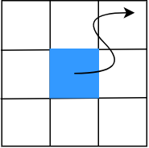
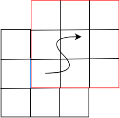

# ft_vox
In this repository, I created a voxel engine similar to Minecraft. The terrain is created randomly using procedural generation using [Perline noise](https://en.wikipedia.org/wiki/Perlin_noise#:~:text=Perlin%20noise%20is%20a%20procedural,details%20are%20the%20same%20size.), and an infite number of maps can be generated.

<br><br>

## Procedural generation
[Procedural generation](https://en.wikipedia.org/wiki/Procedural_generation) is a technique used in animation, visual effects, game development, and many other fields to create digital content algorithmically instead of manually designing it. It would be too dedious for designers to create huge terrains by hand, so we use the power of algorithms to create natural terrains. [Perline noise](https://en.wikipedia.org/wiki/Perlin_noise#:~:text=Perlin%20noise%20is%20a%20procedural,details%20are%20the%20same%20size.) is famous as the method of procedural generation. Please check [my article](https://medium.com/@hirok4/create-random-3d-terrain-by-using-perline-noise-546c6de2a166) if you want to know how to create 3D terrain by using perline noise.

<br><br>

## How to create an infinite map
If we use procedural generation for creating random terrain, how can we continue to create maps infinitely? I came up with the following algorithm and will introduce it to you.

### 1. Check camera position
We check the camera position every frame. If camera moves to far away from the center of the current map(Blue area in the image below), we create the new map.



### 2. Create a new map
We create a new map by using Perline noise. I used the [code](https://github.com/Hiroaki-K4/perline_noise) I previously made with python to implement Perline noise.

### 3. Update the map
We update from old map to new map. In the below image, the area surrounded by red square is the new map.



<br></br>

## How to play
You can play with infinite maps by running following commands.

```bash
export LD_LIBRARY_PATH=LD_LIBRARY_PATH:glfw/build/src
export LIBGL_ALWAYS_INDIRECT=0
cd srcs
make
./ft_vox
```


You can move around by doing the following.

- Forward -> `w`
- Backward -> `s`
- Right -> `d`
- Left -> `a`
- Up -> `e`
- Down -> `q`
- Camera view & scaling  -> `mouse`

Enjoy it!

<br></br>

## References
- [Learn OpenGL: Learn modern OpenGL graphics programming in a step-by-step fashion](https://learnopengl.com/book/book_pdf.pdf)
- [Let's Make a Voxel Engine](https://sites.google.com/site/letsmakeavoxelengine/home)
- [perline_noise](https://github.com/Hiroaki-K4/perline_noise)
- [How do you generate tileable Perlin noise?](https://gamedev.stackexchange.com/questions/23625/how-do-you-generate-tileable-perlin-noise)
- [Understanding Perlin Noise](https://adrianb.io/2014/08/09/perlinnoise.html)
- [Improving Noise](https://mrl.cs.nyu.edu/~perlin/paper445.pdf)
- [An Image Synthesizer](https://dl.acm.org/doi/pdf/10.1145/325165.325247)
- [Custom hillshading in a 3D surface plot](https://matplotlib.org/stable/gallery/mplot3d/custom_shaded_3d_surface.html#sphx-glr-gallery-mplot3d-custom-shaded-3d-surface-py)
